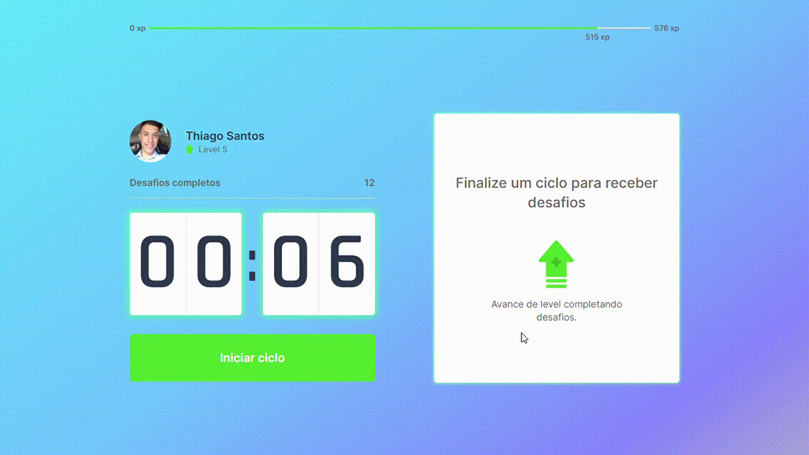

<h1 align="center"><strong>Luvy</strong></h1>

<h1>

</h1>

 <h3 align="center">
<a href="https://luvy.vercel.app"> 🚀 Acessar a demonstração da LUVY</a></h3>

## 📖 ***Sobre***

O projeto *LUVY* é um aplicativo baseado na técnica de *Pomodoro*, onde você passa 25 minutos do seu tempo totalmente dedicado a cumprir uma tarefa, quando bater 25 minutos no seu relogio, você tem 5 minutos para relaxar, tomar um café/água, ou até mesmo revisar a tarefa cumprida.

Entenda mais sobre a técnica de pomodoro neste vídeo do [IlustradaMente](https://www.youtube.com/watch?v=hfxfJ7Qa4sg).

### ***O que é a técnica de pomodoro?***

A técnica se baseia na ideia de que dividindo o nosso fluxo de trabalho em blocos de concentração intensa, conseguimos melhorar a agilidade do cérebro e estimular nosso foco. Em outras palavras, melhoramos nossa gestão do tempo e ficamos mais eficientes.

Entenda mais neste artigo do [Wikipedia](https://pt.wikipedia.org/wiki/T%C3%A9cnica_pomodoro).
___

## 📌 Tecnologias utilizadas

O projeto foi desenvolvido utilizando as seguintes tecnolgias

- [NodeJS](https://nodejs.org/en/)
- [NextJS](https://nextjs.org/)
- [ReactJS](Vhttps://pt-br.reactjs.org/)
___
💻 O projeto foi desenvolvido por Thiago Santos, com a ajuda do grupo [Rocketseat](https://rocketseat.com.br/) onde disponibilizam um evento 100% online e gratuito chamado, next level week (NLW).
